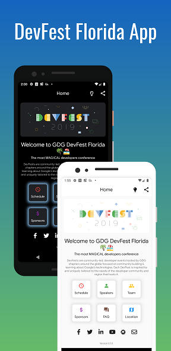
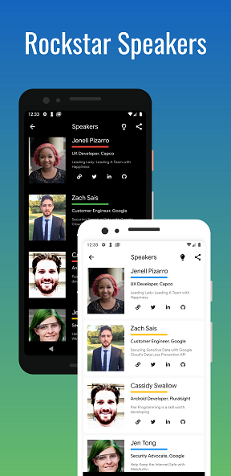
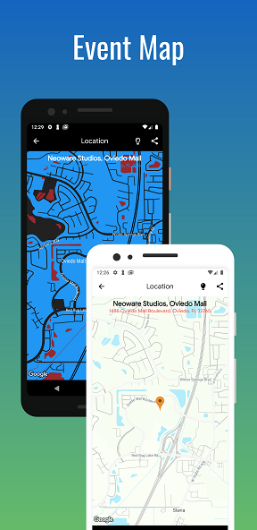
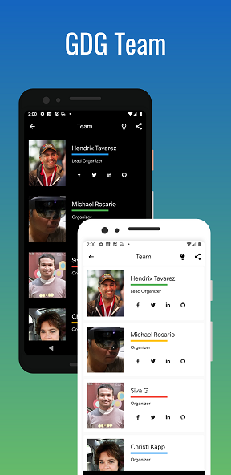

# The GDG DevFest Florida App 🌴🏖️ 2024

Experience the magic of DevFest FL the most MAGICAL 🎆 developers conference in Florida with our official Flutter app! Stay updated with the latest schedule, speakers, and event location information.

## <p align="center">ScreenShots 🖼️</p>

<center>

|              Light/Dark Theme               |               Light/Dark Theme             |             Light/Dark Theme               |               Light/Dark Theme             |
|   :--------------------------------:  |   :---------------------------------: |   :--------------------------------:  |   :---------------------------------: |
|     |  |     |    |

</center>

### <p align="center">Conference information 🍊</p>

DevFest Florida is a yearly Google Developers conference taking place in Central Florida. Run by GDG Sun Coast, GDG Space Coast, and GDG Central Florida, and covering Web, Mobile, Startup, IoT, VR/AR, Cloud, Machine Learning, AI, and much more. Join us and the Local Developer Experts, Googlers, and Startups to learn about the latest and greatest on your favorite technology stacks and business processes.

The event is for the tech community and run by volunteers. Our goal is to raise awareness and create actionable learning to ensure the success of our tech community.

### Technology

- Flutter Framework
- Dart
- Flutter BloC

#DevFest #DevFestFL

We hope to see you there.  🙋‍♀️🙋🏿‍♂️ → Get your ticket today at 👉 [devfestflorida.com](https://devfestflorida.com/)

## Getting Started

1. [Fork repository](https://github.com/iampawan/GDG-DevFest-App/fork) and clone your fork locally
2. Install [Flutter](https://flutter.dev/docs/get-started/install)
3. Install [Android Studio](https://flutter.dev/docs/development/tools/android-studio) or [Project IDX](https://idx.google.com/) or any IDE
4. [Preparing Deployment](https://docs.flutter.dev/deployment)

### Recreating Android Project

If you need to recreate the Android project for any reason, run the following command in the root directory:

```bash
flutter create --project-name devfestfl .
```

This command is necessary because the root folder is named `DevFest_FL_2024` while the project name in `pubspec.yaml` is `devfestfl`.


A few resources to get you started if this is your first Flutter project:

- [Lab: Write your first Flutter app](https://flutter.dev/docs/get-started/codelab)
- [Cookbook: Useful Flutter samples](https://flutter.dev/docs/cookbook)

For help getting started with Flutter, view our
[online documentation](https://flutter.dev/docs), which offers tutorials,
samples, guidance on mobile development, and a full API reference.

## Contributing

You can contribute to the Application and it will be greatly aprreciated. For details, check out [CONTRIBUTING.md](CONTRIBUTING.md).

## Contact / Social Media

- Twitter – [@seetechnologic](https://twitter.com/seetechnologic)
- GitHub - [https://github.com/JavaVista/](https://github.com/JavaVista/)
- LinkedIn - [Javier Carrion](https://www.linkedin.com/in/technologic)
- Website - [techno-logic.us](https://www.techno-logic.us)

### License

Distributed under the MIT License. Note: Copyright and license text of third party modules are included in their source code.

See the [](LICENSE.md)
for more information.

### Versions:

#### Current Versions:

* Flutter Version: 3.24.0
* Dart SDK Version: 3.5.0

#### Project was original created from the following versions:

* Flutter Version: 1.9.1 
* Dart SDK Version: Between 2.5.0 and 3.0.0.