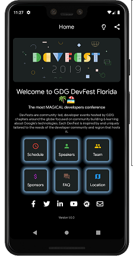
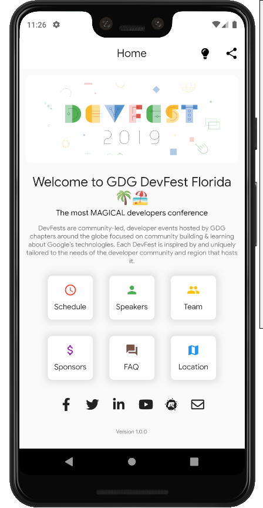
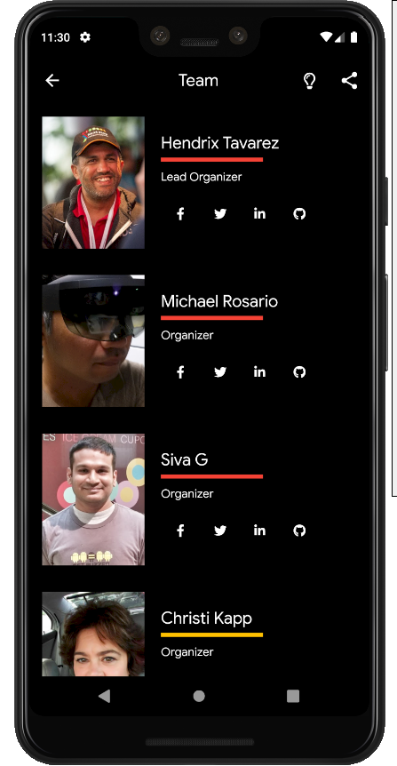
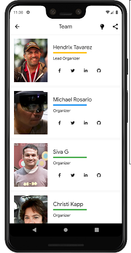
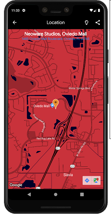
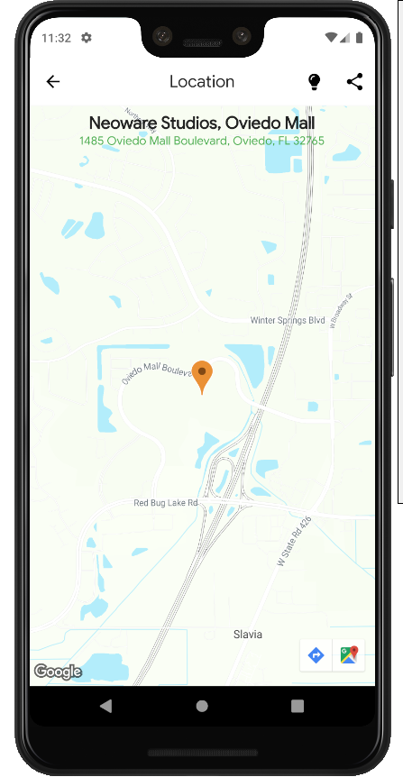

# The GDG DevFest Florida App

A Flutter App developed for the most MAGICAL developers conference in Florida.

## ScreenShots 🖼️

|             Dark Theme              |              Light Theme              |
| :----------------------------------: | :----------------------------------: |
|  |  |
|  |  |
|  |  |

## Getting Started

This project is a starting point for a Flutter application.

A few resources to get you started if this is your first Flutter project:

- [Lab: Write your first Flutter app](https://flutter.dev/docs/get-started/codelab)
- [Cookbook: Useful Flutter samples](https://flutter.dev/docs/cookbook)

For help getting started with Flutter, view our
[online documentation](https://flutter.dev/docs), which offers tutorials,
samples, guidance on mobile development, and a full API reference.

## Contributing

For details, check out [CONTRIBUTING.md](CONTRIBUTING.md).

## Contact / Social Media

- Twitter – [@seetechnologic](https://twitter.com/seetechnologic)
- GitHub - [https://github.com/JavaVista/](https://github.com/JavaVista/)
- LinkedIn - [Javier Carrion](https://www.linkedin.com/in/technologic)
- Website - [techno-logic.us](https://www.techno-logic.us)

### License

Distributed under the MIT License. Note: Copyright and license text of third party modules are included in their source code.

See the 
for more information.